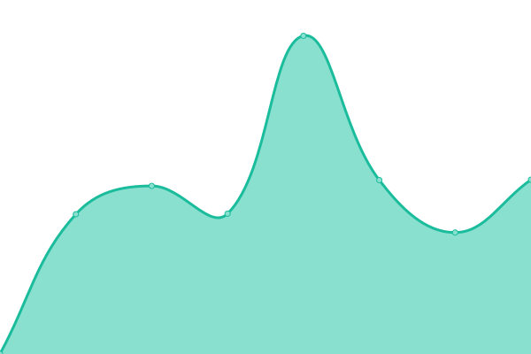

# [📈 Live Status](https://mozo-works.github.io/upptime): <!--live status--> **🟩 All systems operational**

This repository contains the open-source uptime monitor and status page for [Upptime](https://upptime.js.org), powered by [Upptime](https://github.com/upptime/upptime).

<!--start: status pages-->
<!-- This summary is generated by Upptime (https://github.com/upptime/upptime) -->
<!-- Do not edit this manually, your changes will be overwritten -->
<!-- prettier-ignore -->
| URL | Status | History | Response Time | Uptime |
| --- | ------ | ------- | ------------- | ------ |
|  [Google](https://www.google.com) | 🟩 Up | [google.yml](https://github.com/mozo-works/upptime/commits/HEAD/history/google.yml) | 

 93ms
     
 | 

<a href="https://mozo-works.github.io/upptime/history/google">100.00%</a>
    

|  [Naver](https://www.naver.com) | 🟩 Up | [naver.yml](https://github.com/mozo-works/upptime/commits/HEAD/history/naver.yml) | 

 840ms
     
 | 

<a href="https://mozo-works.github.io/upptime/history/naver">100.00%</a>
    

|  [Dcamp](https://dcamp.kr) | 🟩 Up | [dcamp.yml](https://github.com/mozo-works/upptime/commits/HEAD/history/dcamp.yml) | 

 1130ms
     
 | 

<a href="https://mozo-works.github.io/upptime/history/dcamp">100.00%</a>
    

<!--end: status pages-->
